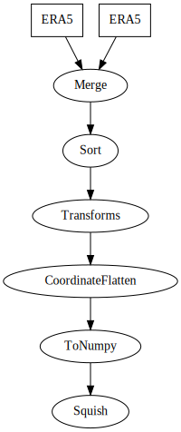

# Pipeline Version 2

A rework of the pipeline setup to improve parallelisation and overall usability.

Integrated fully with `edit.data` to build pipelines of operations applied to data.

## Examples

A pipeline should be a sequence of steps, with optional branches.

Here is an example pipeline, for use with PanguWeather.

```python

import edit.data
import edit.pipeline


data_preperation = edit.pipeline.Pipeline(
    (
        edit.data.archive.ERA5(['msl', '10u', '10v', '2t']), 
        edit.data.archive.ERA5(['z', 'q', 't', 'u', 'v'], level_value = [50, 100, 150, 200, 250, 300, 400, 500, 600, 700, 850, 925, 1000])
    ),
    edit.pipeline.operations.xarray.Merge(),
    edit.pipeline.operations.xarray.Sort(['msl', '10u', '10v', '2t', 'z', 'q', 't', 'u', 'v']),
    edit.pipeline.operations.Transforms(
        apply = edit.data.transforms.coordinates.standard_longitude(type = '0-360') + edit.data.transforms.coordinates.ReIndex(level = 'reversed')
        ),
    edit.pipeline.operations.xarray.reshape.CoordinateFlatten('level'),
    edit.pipeline.operations.xarray.conversion.ToNumpy(),
    edit.pipeline.operations.numpy.reshape.Squish(1),
)
```

This pipeline can then be viewed as a graph

```python
data_preperation.graph()
```



## Installation

### Pypi

```shell
pip install edit-pipeline_V2
```

### On Gadi

On gadi prebuilt modules exist

```shell
module use /scratch/ra02/modules
module load EDIT
```
