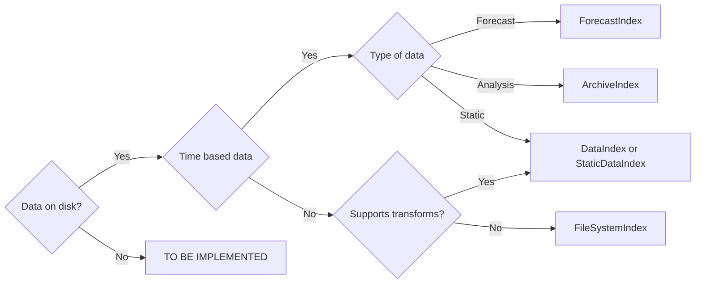

# Developing DataIndexes

It is possible to extend `edit` to new datasets or to provide a different way to index into existing datasets.

The functionality of the [indexes][edit.data.indexes] is split into various classes and mixins. This is done to enable a user
to easily mix together an appropriate selection of functionality and integration to match the dataset in question.

Data with any unusual structures or sources has to be implemented directly, but those which follow a set pattern, may find the
[PatternIndex][edit.data.patterns] enough to load the data.

The following table attempts to break down the purpose of and when to use a few of the commonly used classes.

## Indexes

| Index | Purpose | When to use |
| ----- | ------------------------ | ---- |
| [ArchiveIndex][edit.data.indexes.ArchiveIndex] | Default class for Archived data | Any standard dataset, ERA5, ACCESS, BRAN etc |
| [ForecastIndex][edit.data.indexes.ForecastIndex] | Base class for Forecast data, combines DataIndex and FileSystemIndex | Forecast Data |
| [StaticDataIndex][edit.data.indexes.StaticDataIndex] | Base class for Static Data, combines DataIndex and FileSystemIndex | Static Files |
| [PatternIndex][edit.data.patterns] | Pattern Based Indexing | Saving data, or loading data saved in a clear pattern |

## Choosing Implementation

The following diagram breaks down how to decide which class to implement.



## Example Data Flow

See [Data Flow](/documentation/data/Developing Your Own/dataflow) for information on how data and indexing flows through `edit`.

## Basic New Index

`edit` attempts to remove most of the repeated code of loading data, and provide simple functions to overload to fill in the gaps. However, for more complex datasets this abstraction may not provide the neccessary functionality, and the user will have to provide more explicit lower level functionality.

| Complexity | Process |
| --- | ---|
| Simplest | Add `filesystem` function to provide file location |
| Slighly More | Specify `transforms` to prepare data |
| Moderate | Provide entire `load` function |

This following example will show how to add an analysis dataset which exists on disk, and only the `filesystem` function need be implemented.

??? Help "EDITDatetime behaviour"
    `ArchiveIndex` attempts to cast the first argument passed to it's `search` function to an [EDITDatetime][edit.data.time]. However, this can fail quietly.

!!! Note
    Include `self.make_catalog()` in the `__init__` for cataloging features to work.

```python
import edit.data

class NewDataIndex(edit.data.ArchiveIndex):
    def __init__(self, variables: list | tuple):
        super().__init__()
        self.make_catalog()
        self.variables = variables

    def filesystem(self, time : edit.data.EDITDatetime):
        """
        Return the location of files on disk
        """
        files = {}
        for var in self.variables:
            files[var] = f"/data/is/on/disk/here/{var}/{time}.nc"
        return files        

```

## Adding Transforms

Using the format as detailed above, the defined class never actually touches the data, so any quirks are not yet handled. [DataIndex][edit.data.indexes.DataIndex] provides the transform capability for `edit` and allows a `transforms` argument on initalisation. It is thus recommended that any `transforms` to be applied on every data loading step be provided here.

It is suggested the following transforms always be added,

- `variables.variable_trim` if other variables are loaded
- `variables.rename_variables` if variables change names between filename and data

The rest are up to the user to provide the functionality to load that dataset.

## Date Resolution

`edit` provides an advanced temporal indexing feature by use of the [AdvancedTimeIndex][edit.data.indexes.AdvancedTimeIndex] class. Such as automatically finding all data in a specified date resolution, e.i. `2021` containing all data in 2021.

This functionality requires the specification of `data_resolution`, and thus should be provided.

## Other Information

See [decorators](/documentation/data/Developing Your Own/decorators) for information on decorating your index to limit input ranges.

If the dataset to be indexed does not fit the mold above, review the various classes implemented, and fit together the features that make sense for your implementation
