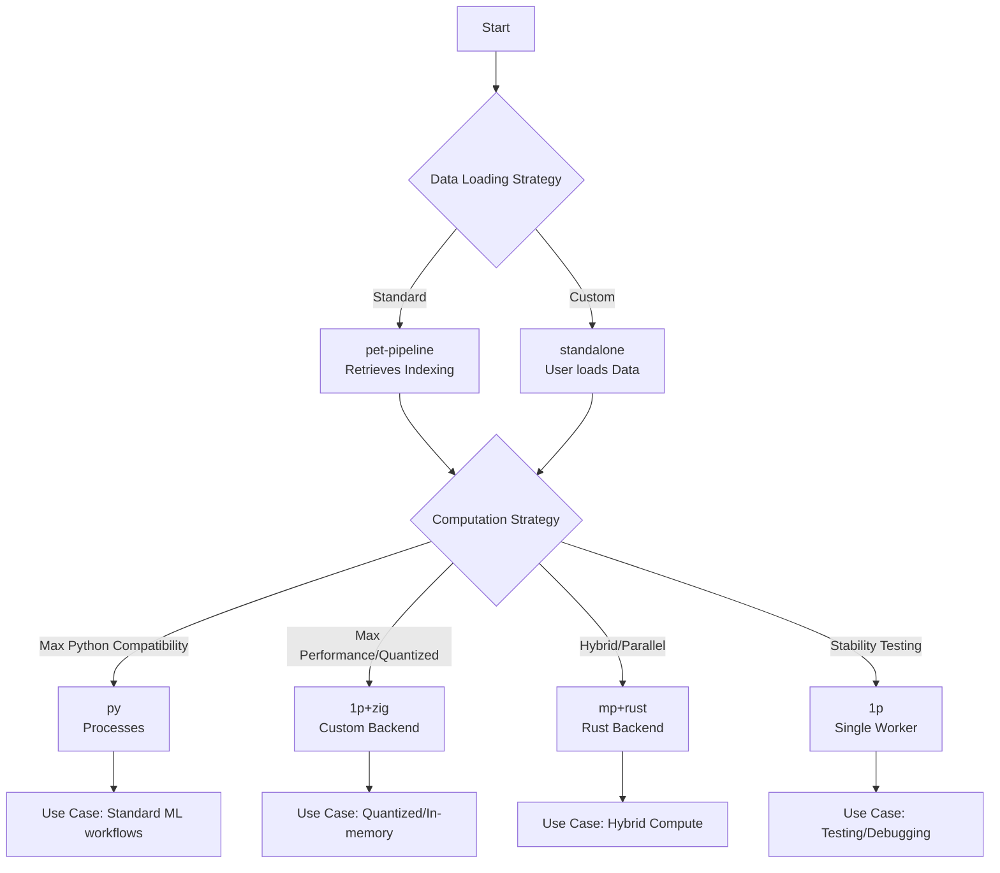

## Overview & Philosophy

Examples in this folder serve as patterns and architectural blueprints for library usage. They are intended to provide a starting point rather than production-ready, optimized code.

*   **Not Optimal:** These examples represent "worst-case scenarios" or basic implementations. Assume they are inefficient.
*   **Iterative Improvement:** If you find a better way to perform a task, commit it to the codebase and use it to forge a new, improved example for future users.
*   **Goal:** The objective is functional and *functioning* code. Current benchmarks take 5 minutes for 8 time instances; verification requires better performance.

## Technical Context: Persistence Models

Persistence models (statistical methods like mean, median, etc.) differ significantly from inference models (pre-trained weights) in computational requirements.

### Comparison: Persistence vs. Inference

| Attribute | Persistence Models | Inference Models |
| :--- | :--- | :--- |
| **Hardware** | CPU only (No GPU usage) | GPU Accelerated (Tensor calculations) |
| **Data Requirement** | Requires extensive historical data | Weights encode historical data |
| **Performance** | Slower than GPU inference | Faster due to weight encoding |
| **Parallelism** | Avoids existing paradigms (e.g., Dask) if data is associated with them | Utilizes standard parallel paradigms |
| **Chunking** | Spatial (2D) preferred | Temporal (Time) preferred |

**Why this is a pain point:** Software cannot solve all storage and loading inefficiencies. Hardware and platform-specific storage paradigms are often the root cause. While libraries can improve data processing predictability, they cannot universally solve nuanced data loading issues.

## Execution Modes

The examples are organized around specific execution paradigms. Understanding these modes is critical to selecting the correct example for your environment.

### Core Concepts

*   **`pet-pipeline` (Default):** The library pipeline retrieves file information (indexing).
    *   *Note:* Retrieving file metadata is less costly than loading raw data for arbitrarily chunked files.
*   **`standalone` (Custom Loader):** The user is responsible for data loading.
    *   The `pet-pipeline` provides the indexing/accessor, but the actual data is fetched via custom logic.
*   **`mp` (Multiprocessing):**
    *   `py`: Uses Python processes (disables Dask).
    *   `1p`: Single worker (serial processing).
*   **`<backend_name>` (e.g., `zig`):** Backend-specific computation.
    *   Assumption: Backend ingests chunks from the `pet-pipeline` and chunking is done on-the-fly.
    *   *Note:* This differs from expensive Xarray rechunking operations.

### Execution Matrix

### Selection Guide

> **NOTE:** Not all combinations are implemented. Use the following logic to select the correct example:

| Scenario | Recommended Configuration | Reasoning |
| :--- | :--- | :--- |
| **Testing / Simple Methods** | `1p + py` | Minimal overhead, high compatibility. |
| **High Perf / Quantized / In-Memory** | `1p + zig + standalone` | Enables SIMD/efficient code and quantization (e.g., 4-bit representation). |
| **Hybrid Compute** | `mp + rust` | PET pipeline for data retrieval, Rust for computation. |
| **Platform Constraints** | `standalone` | Required if you need fine-grained control or if the platform lacks multiprocessing support (e.g., restricted environments). |
| **Backend Control** | `<backend>` | Required if you need custom computation logic (e.g., Numpy vs. Zig). |

## Available Examples

### Linux / HPC Environment

These examples are optimized for Linux systems (e.g., RHEL8, Arch Linux) typically running on HPC nodes.

| Filename | Description | Execution Context |
| :--- | :--- | :--- |
| `nci_py_mp.py` | Multiprocessing with Python on NCI. Uses **PET pipeline**. | HPC / Linux |
| `nci_py_mp_standalone.py` | Multiprocessing with Python on NCI. Uses **adhoc loading**. | HPC / Linux |
| `anylinux_py_mp.py` | Multiprocessing with Python. Uses **PET pipeline**. | Any Linux (tested Arch) |
| `anylinux_py_standalone.py` | Multiprocessing with Python. Uses **adhoc loading**. | Any Linux |

### General / Local Environment

These examples focus on portability across different architectures and operating systems.

| Filename | Description | Execution Context |
| :--- | :--- | :--- |
| `any_py_1p.py` | Sequential processing with Python. Best for **portability** (Windows/Mac/Linux). | Any OS / Architecture |

### Experimental / Backend Specific

These examples utilize specific backends (e.g., Zig) and may require additional C libraries or specific OS support.

| Filename | Description | Notes |
| :--- | :--- | :--- |
| `zigc.py` | Contains various approaches using the **Zig backend** for computation. | **Linux only**. Tested with parallel HDF5 loader, single-threaded, and NCI contexts. Use at your own risk. |

> **Resources:** Refer to the following technical documentation for deeper understanding of data storage and loading nuances:
> *   [ATPESC 2023: Principles of HPC I/O](https://extremecomputingtraining.anl.gov/wp-content/uploads/sites/96/2023/08/ATPESC-2023-Track-7-Talk-2-carns-io-principles.pdf)
> *   [NCSA HDF5 Introduction](https://learn.ncsa.illinois.edu/pluginfile.php/20067/mod_label/intro/HDF_NCSA_3_2024.pdf)

