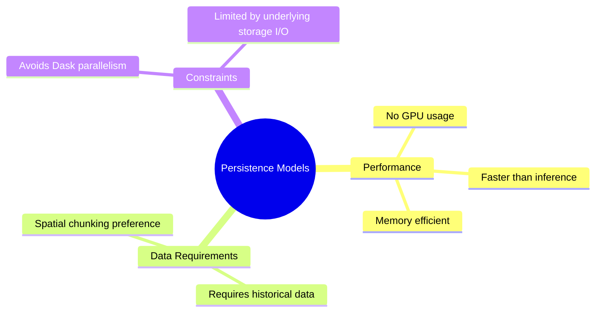
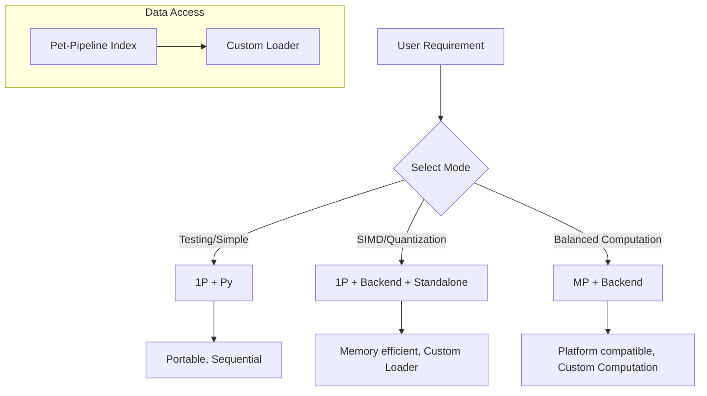

# Examples

## Rationale

Examples serve as patterns to demonstrate library pathways. While examples are often boilerplate, they provide entry points for optimization. Users are encouraged to scrutinize these examples to find more efficient implementations for their specific use-cases. If a superior method is discovered, it should be committed to the codebase, with the example updated to reflect this improvement.

## Technical Context: Persistence Models

Persistence models are designed for memory efficiency and speed, distinct from inference models which rely on pre-encoded weights and GPU acceleration.

### Storage & Performance Goals

The library aims to provide functional and efficient code. However, persistence computations are currently limited by underlying hardware and storage paradigms, rather than software efficiency alone.

*   **Current Limitations:** Computation of simple statistics on weather data (HPC) can take hours due to data loading inefficiencies and inconsistent storage.
*   **Library Scope:** PET provides access patterns and loaders (`pet-pipeline`) to mitigate data loading, but it does not universally solve I/O bottlenecks or hardware latency.
*   **Acceptable Performance:** A runtime of 5 minutes for 8 time instances is considered unacceptable and requires optimization of storage/processing pipelines.

## Configuration Architecture

The examples below demonstrate different approaches to data loading (`pet-pipeline` vs `standalone`) and computation (`mp`, `py`, `backend`).

### Core Configuration Options

| Configuration | Description | Use Case |
| :--- | :--- | :--- |
| **Default** | Uses `pet-pipeline` for data retrieval and indexing. | Standard workflow. |
| **Standalone** | Uses `pet-pipeline` for indexing only; user implements custom loader. | Fine-grained control, non-multiprocessing platforms. |
| **MP/Py** | Python multiprocessing (`mp`) disabling Dask. | Linux/Forkserver contexts, maximum PET compatibility. |
| **1P** | Single worker process. | Stability testing, debugging. |
| **Backend** (e.g., `zig`) | Backend-specific computation (e.g., SIMD, Rust). | Specific hardware optimization or custom C-library integration. |

### Usage Guidelines

*Note: Not all combinations of the above options are exhaustive, but they provide sufficient patterns to construct custom requirements.*

## Example Files

The following table maps specific examples to their environments, modes, and purposes.

| Filename                    | Environment                   | Mode              | Description                                                                                                                                                 |
| :---                        | :---                          | :---              | :---                                                                                                                                                        |
| `nci_py_mp.py`              | NCI Linux (RHEL8-like)        | MP + PET Pipeline | Multiprocessing with satellite data using the standard pipeline.                                                                                            |
| `nci_py_mp_standalone.py`   | NCI Linux (RHEL8-like)        | MP + Standalone   | Ad-hoc data loading on NCI, bypassing the standard pipeline.                                                                                                |
| `anylinux_py_mp.py`         | Any Linux (Arch tested)       | MP + PET Pipeline | Multiprocessing on general Linux environments with PET pipeline.                                                                                            |
| `anylinux_py_standalone.py` | NCI Linux (RHEL8-like)        | MP + Standalone   | Ad-hoc loading on NCI.                                                                                                                                      |
| `any_py_1p.py`              | Local Machine (Win/Mac/Linux) | 1P + Py           | Single-threaded processing for portability. May be slower.                                                                                                  |
| `zigc.py`                   | Linux Only                    | Zig Backend       | Computation examples using Zig. Includes parallel HDF5 loader examples and single-threaded variants. *Note: Linux required; not tested on other platforms.* |
