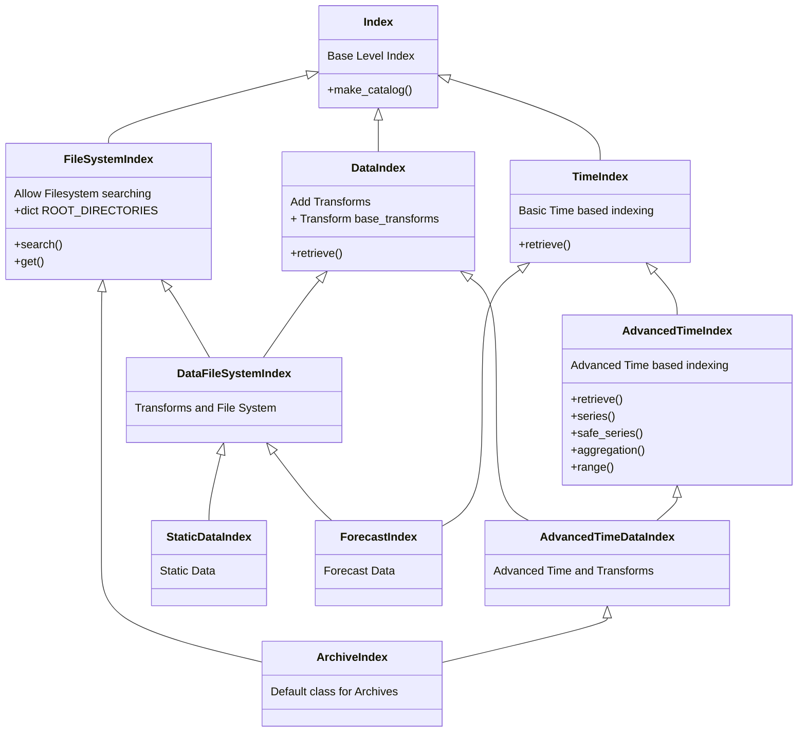

# Data Flow

`edit.data` uses the following inheritance structure

```mermaid
classDiagram
    Index <|-- FileSystemIndex
    Index <|-- DataIndex
    Index <|-- TimeIndex
    TimeIndex <|-- AdvancedTimeIndex
    DataIndex <| -- AdvancedTimeDataIndex
    AdvancedTimeIndex <| -- AdvancedTimeDataIndex
    FileSystemIndex <| -- ArchiveIndex
    AdvancedTimeDataIndex <| -- ArchiveIndex
    FileSystemIndex <|-- DataFileSystemIndex
    DataIndex <| -- DataFileSystemIndex
    DataFileSystemIndex <| -- StaticDataIndex
    DataFileSystemIndex <| -- ForecastIndex
    TimeIndex <| -- ForecastIndex

    class Index{
        Base Level Index
        +make_catalog()
    }
    class FileSystemIndex{
        Allow Filesystem searching
      +dict ROOT_DIRECTORIES
      +search()
      +get()
    }
    class DataIndex{
        Add Transforms
      + Transform base_transforms
      +retrieve()
    }
    class TimeIndex{
        Basic Time based indexing
      +retrieve()
    }
    class AdvancedTimeIndex{
        Advanced Time based indexing
      +retrieve()
      +series()
      +safe_series()
      +aggregation()
      +range()
    }
    class AdvancedTimeDataIndex{
        Advanced Time and Transforms
    }
    class DataFileSystemIndex{
        Transforms and File System
    }
    class ArchiveIndex{
        Default class for Archives
    }
    class ForecastIndex{
        Forecast Data
    }
    class StaticDataIndex{
        Static Data
    }
```