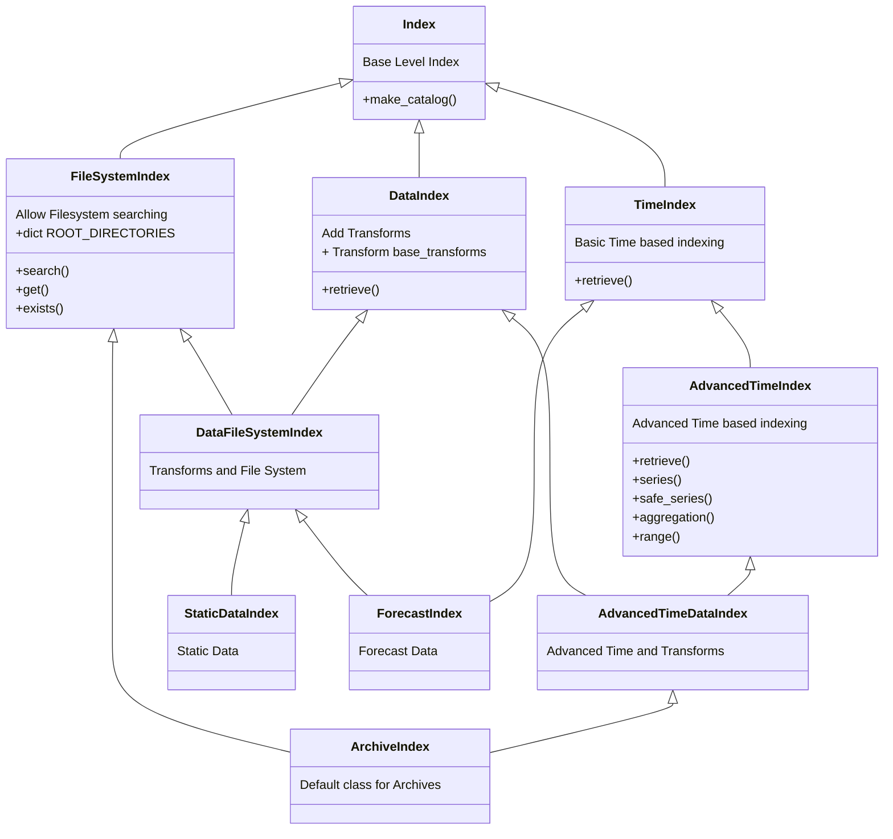

# EDIT.data

[edit.data][edit.data] aims to provide a simple interface with which to index into Earth Science related Datasets. Currently this is limited to netcdf geospatial data sources, with extensions to other grids, meshes or formats expected.

One of the base classes of `edit.data` is the `DataIndex`, which provides a unified interface to accessing data, and common data retrieval techniques.

Each of the implemented data sources requires it's own initialisation parameters to get started. But once initialised only the timestamp is needed.

!!! Note
    If the dataset you want is not already implemented, it is easy to implement it yourself and still gain the full benefits of [edit.data][edit.data]. The process for this can be found [here](/documentation/data/Developing Your Own/index.md)

## Currently Implemented

`edit.data` consists of the archive indexes, pattern based indexes, and downloading indexes. This allows a seperation between various data locations, user created data, or globally accessible data. The following tables list the implemented sources.

### Archives

Only NCI has built archives, so if another archive system is needed, these archives can be used as a template.

- ERA5
- BRAN
- BARRA
- OceanMaps
- Himiwari 8/9
- AGCD
- ACCESS
- CMIP
- MODIS
- BARPA

### Patterns

If data follows a clear pattern, a [PatternIndex][edit.data.patterns] can be used to access the data. This `Index` is particularly useful for saving out user generated data into a consistent structure, and is thusly used in the downloader, and CachingIndex.

- ExpandedDate
- Direct
- ArgumentExpansion

This patterns then have support for being a temporal index, or splitting per variable.

### Download

If operating on a system without saved data, `edit.data` is beginning to support downloading data from various sources, and caching it to disk.

To create another subclass [DownloadIndex][edit.data.download.DownloadIndex] and provide a `download` method.

- cds (Copernicus Data Store)
- ERA5 - cds


### Derived

Some data can be calculated are accessible at `edit.data.derived`.

- Insolation

## Examples

Take note how similar each data retrieval option is

=== "ERA5"
    ```python
    import edit.data

    ## Date of interest
    doi = '2022-04-01T03:00'

    ## Initialise the Data Loader
    dataloader = edit.data.archive.ERA5(variables = 'tmax', level = 'single')

    ## Get Data
    dataloader(doi)

    # <xarray.Dataset>
    # Dimensions:               (time: 1, latitude: 361, longitude: 720)
    # Coordinates:
    # * longitude               (longitude) float32 -180.0 -179.5 -179.0 ... 178.5 179.0 179.5
    # * latitude                (latitude) float32 90.0 89.5 89.0 88.5 ... -89.0 -89.5 -90.0
    # * time                    (time) datetime64[ns] 2022-04-01T03:00:00
    # Data variables:
    #     tmax                  (time, latitude, longitude) float32 

    ```
=== "satellite"
    ```python
    import edit.data

    ## Date of interest
    doi = '2022-04-01T03:00'

    ## Initialise the Data Loader
    dataloader = edit.data.archive.satellite(variables = 'cloud_optical_depth')

    ## Get Data
    dataloader(doi)

    # <xarray.Dataset>
    # Dimensions:               (time: 1, latitude: 1726, longitude: 2214)
    # Coordinates:
    # * longitude               (longitude) float32 112.0 112.0 112.0 ... 156.2 156.3
    # * latitude                (latitude) float32 -44.5 -44.48 -44.46 ... -10.02 -10.0
    # * time                    (time) datetime64[ns] 2022-04-01T03:00:00
    # Data variables:
    #     cloud_optical_depth   (time, latitude, longitude) float64 nan nan ... nan nan
    ```

=== "BRAN"
    ```python
    import edit.data

    ## Date of interest
    doi = '2022-04-01'

    ## Initialise the Data Loader
    dataloader = edit.data.archive.BRAN(variables = 'ocean_eta_t', type = 'daily')

    ## Get Data
    dataloader(doi)

    # <xarray.Dataset>
    # Dimensions:               (time: 1, latitude: 1500, longitude: 3600)
    # Coordinates:
    # * longitude               (longitude) float32 -179.9 -179.9 -179.8 ... 179.8 179.9 179.9
    # * latitude                (latitude) float32 -74.95 -74.85 -74.75 ... 74.75 74.85 74.95
    # * time                    (time) datetime64[ns] 2022-04-01T12:00:00
    # Data variables:
    #     eta_t                 (time, latitude, longitude) float32 dask.array<chunksize=(1, 905, 378), meta=np.ndarray>
    ```

## Structure

The following diagram details how the base inheritance structure works for `edit.data`


