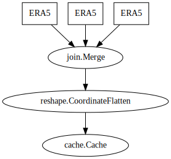
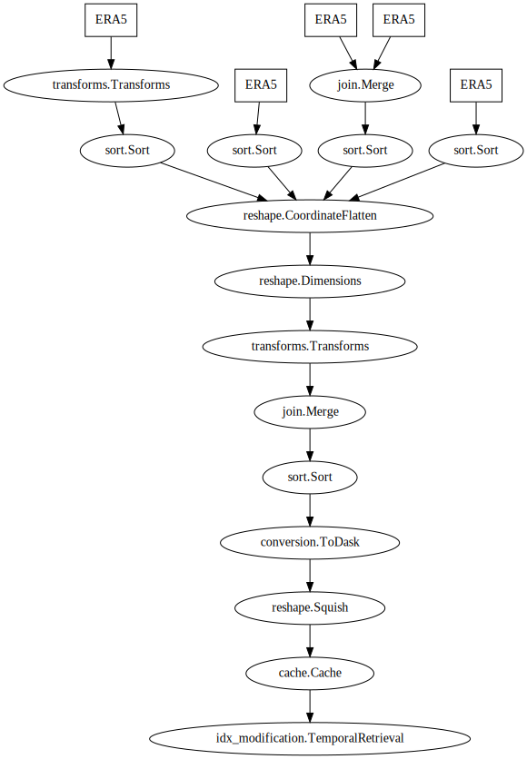

# Creating a Pipeline

The easiest way to conceptualise the creation of a pipeline is to liken it to a puzzle. It's about getting the right pieces in the right spots, individually they don't look like much, but together an image, or a process comes together.

Let's look at an example, first a simple one, then a more complex one.


## Examples

### Simple

Passing operations or Indexes as a tuple created a branching point, with each element representing its own mini pipeline. In this case we are using that to create a separation of incoming data, 3 ERA5 indexes. They will each get data based on the index and be returned as elements of a tuple.

Afterwards, a merge is required to combine them into one larger dataset. The rest of the pipeline can now be considered 'formatting', here we are splitting the data based on the level, so expanding out `t`. Then cache it on to disk for quicker retrieval.

```python
import edit.data
import edit.pipeline

edit.pipeline.Pipeline(
    (
        edit.data.archive.ERA5('tcwv')
        edit.data.archive.ERA5('2t'),
        edit.data.archive.ERA5('t'),
    ),
    edit.pipeline.operations.xarray.Merge(),
    edit.pipeline.operations.xarray.reshape.CoordinateFlatten('level'),
    edit.pipeline.modifications.Cache('temp'),
)
```



### Complex

Switching things up, here we have a much more complex pipeline, which consists of all the same style of operations as shown above, just nested further, and with more steps.

We still have the branches of data, but now they consist of more then one step, and have operations applied to each of them. We even have one which hold a branch in of itself. 

Afterwards, each element of data gets flattened, reshaped, and transformed, finally being merged, and converted to a dask array. Then some dask operations take place, finally concluding with a cache.

```python
import edit.data
import edit.pipeline

edit.pipeline.Pipeline(
    (
        (
            edit.data.archive.ERA5(['tcwv', 'skt', 'sp']), 
            edit.pipeline.operations.Transforms(
                apply = edit.pipeline.operations.transform.AddCoordinates(('latitude', 'longitude'))), 
            edit.pipeline.operations.xarray.Sort(('var_latitude', 'var_longitude', 'tcwv', 'skt', 'sp'))),
        (
             edit.data.archive.ERA5(['t', 'u', 'v'], level_value = [1,50,150,250,400,600,750,900,1000]), 
            edit.pipeline.operations.xarray.Sort(('t', 'u', 'v'))
        ), 
        (
            (
             edit.data.archive.ERA5(
                ['mtnlwrf', 'msdwswrf', 'msdwlwrf', 'mtpr', 'mslhf', 'msshf', 'mtnswrf', 'mtdwswrf', 'msnswrf', 'msnlwrf'],
                transforms = edit.data.transforms.derive(
                    mtupswrf = 'mtnswrf - mtdwswrf', 
                    msupswrf = 'msnswrf - msdwswrf', 
                    msuplwrf = 'msnlwrf - msdwlwrf', 
                    drop = True
                    )
                ), 
            edit.data.archive.ERA5('!accumulate[period:"6 hours"]:tp>tp_accum')
            ), 
            edit.pipeline.operations.xarray.Merge(), 
            edit.pipeline.operations.xarray.Sort(('mslhf', 'msshf', 'msuplwrf', 'msupswrf', 'mtnlwrf', 'mtpr', 'mtupswrf', 'tp_accum'))
        ), 
        (
            edit.data.archive.ERA5(['mtdwswrf', 'z_surface', 'lsm', 'ci']), 
            edit.pipeline.operations.xarray.Sort(('mtdwswrf', 'z', 'lsm', 'ci'))
        ), 
    ),
    edit.pipeline.operations.xarray.reshape.CoordinateFlatten('level', skip_missing=True),
    edit.pipeline.operations.xarray.reshape.Dimensions(('time', 'latitude', 'longitude')),
    edit.pipeline.operations.Transforms(
        apply = edit.data.transform.coordinates.pad(coordinates = {'latitude': 1, 'longitude': 1}, mode = 'wrap') + edit.data.transforms.values.fill(coordinates = ['latitude', 'longitude'], direction = 'forward') + edit.data.transforms.interpolation.like(pipe['2020-01-01T00'], drop_coords = 'time')),

    edit.pipeline.operations.xarray.Merge(),
    edit.pipeline.operations.xarray.Sort(order, safe = True),
    
    edit.pipeline.operations.xarray.conversion.ToDask(),
    edit.pipeline.operations.dask.reshape.Squish(axis=1),
    edit.pipeline.modifications.Cache('temp', pattern_kwargs = dict(extension = 'npy'))
    edit.pipeline.modifications.TemporalRetrieval(((-6, 1), (6,1))),
)
```


## Notes

### Branches

If a tuple within the `steps` is encountered, it will be interpreted as a `BranchingPoint`,
with each element in the `tuple` a separate `Pipeline` of it's own right.
Therefore to have a `BranchingPoint` with each branch containing multiple steps, a nested `tuple` is needed.

E.g. # Pseudocode

```python
Pipeline(
    Index,
    (Operation_1, Operation_2)
)
```
This will cause samples to be retrieved from `Index` and each of the operations run on the `sample`.
The result will follow the form of:
    `(Operation_1 on Index, Operation_2 on Index)`

If a branch consists of multiple operations, the nested tuples must be used.

E.g. # Pseudocode
```python
Pipeline(
    Index,
    ((Operation_1, Operation_1pt2), Operation_2)
)
```
This will cause samples to be retrieved from `Index` and each of the operations run on the `sample`.
The result will follow the form of:
    `(Operation_1 + Operation_1pt2 on Index, Operation_2 on Index)`

A `BranchingPoint` by default will cause each branch to be run separately, and a tuple returned with the results of each branch.
However, if 'map' is included in the `BranchingPoint` tuple, it will be mapped across elements in the incoming sample.

### Mapping
E.g. # Pseudocode
```python
Pipeline(
    Index,
    ((Operation_1, Operation_1pt2), Operation_2, 'map')
)
```
This will cause samples to be retrieved from `Index` and the operations to be mapped to the `sample`.
The result will follow the form of:
    `(Operation_1 + Operation_1pt2 on Index[0], Operation_2 on Index[1])`

'map_copy' can be used to copy the branch to the number of elements in the sample without having to
manually specify each branch.

### Indexes in Branches
Indexes can also be included in branches, which behaviour as expected, where the sample is retrieved rather than operations applied.

E.g. #Pseudocode
```python
Pipeline(
    Index,
    (Operation_1, Operation_2, Index)
)
```

### Transforms
It is possible to use `edit.data.Transforms` directly in the pipeline. They will be executed on both the `apply` and `undo` operations. If other behaviour is needed, see `edit.pipeline.operations.Transform`.

### Filters
Additionally to the simple operations, filters can be added to the pipeline. These have no effects on the `getitem` call, but are particularly useful when iterating over the pipeline. Essentially, they will error when encountering an invalid sample, and skip it.

See [Using a Pipeline](using.md) for more.


## Process

It usually is easiest to construct a `Pipeline` by slowing add more steps and looking at the shape of the output. (Graph markers may be helpful here). 

Step through one step at a time and check to make sure the data looks like what you expect.


Steps to follow
- Get the data you need with indexes
- Merge them if you need
- Apply any xarray operations, (flattening, sorting, ... etc)
- Convert formats if needed
- Cache if needed


## Optimisation Notes

- Cache should go before temporal retrievals to avoid duplicating data
- Stay in dask land as long as possible
