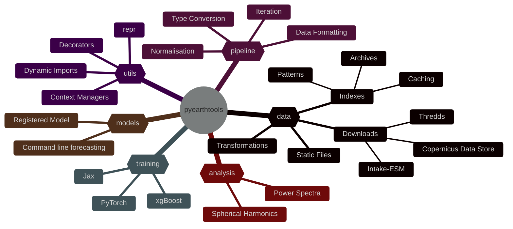
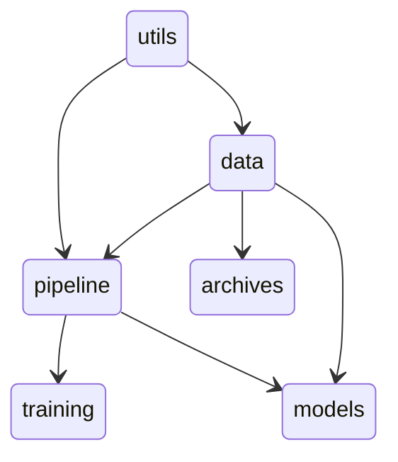

# `pyearthtools` - Environmental Data Intelligence Toolkit

[Installation](started/installation/index.md){ .md-button .md-button--primary } [Reference](reference/pyearthtools/data/index.md){ .md-button .md-button--primary } [Documentation](documentation/index.md){ .md-button .md-button--primary }

<!--  -->

Welcome to the Documentation for `pyearthtools` the Environmental Data Intelligence Toolkit

**This is still a work in progress and a lot shall be changed.**

A research project from the Data Science and Emerging Technologies team and Project 3.1.

## Purpose

`pyearthtools` seeks to provide a unified interface into any Earth System data source, and allow for easy transformation and modification into Machine Learning training / inference ready forms.

Additionally, utilising the advanced data preperation tools, `pyearthtools` contains implementations of various analysis and verification methods.

To enhance scientific exploration and reduce the barrier of entry to testing Machine Learning (ML) models, various state of the art open source models are implemented and available for use.

## Modules

`pyearthtools` consists of a collection of Python packages all underneath the core name space of `pyearthtools`.

Some build upon the others to either provide easier usage or encompass more use cases.



## Dependencies



### `data`

Powerful but generic indexing tools into Earth System data.

`pyearthtools.data` allows for easy indexing into 'any' Earth System dataset once configured, these can be on disk, generated on the fly, cached from a download source, or pulled directly from external servers.
Once available, they can be indexed directly with time resolution aware querying that is agnostic of the particular source being used.

In addition, `pyearthtools.data` provides generic patterns and caching classes for users to easily implement their own sources.

```python
import pyearthtools.data
ERA5_index = pyearthtools.data.download.cds.ERA5('2t')
ERA5_index['2024-01-01T06']
>>> # Data would be retrieved from cds for the given time

ERA5_index.series('2024-01-01T06', '2024-01-03T12', (4, 'hours'))
>>> # Data retrieved from '2024-01-01T06' to '2024-01-03T12' at a 4 hourly interval.
```

### `pipeline`

Reliably, repeatably and effectively transform Earth System data in a configurable pipeline, whether for Machine Learning (ML) models, analysis, or anything else.

Building upon `pyearthtools.data`, `pyearthtools.pipeline` provides a means to transform data in a sequential fashion with full transparency of the steps involved. Any transformation can be undone, and the data restored.
With readable config files, pipelines can be versioned controlled and trusted to provide data in the exact same way.

```python
import pyearthtools.data 
import pyearthtools.pipeline

pipeline = pyearthtools.pipeline.Pipeline(
    pyearthtools.data.download.cds.ERA5('2t'),
    pyearthtools.pipeline.operations.xarray.select.SliceDataset(latitude = (None, None, 2)),
    pyearthtools.pipeline.operations.xarray.values.FillNan(),
)

pipeline['2024-01-01T06']
>>> # Data retrieved from ERA5, sliced to every second element on 'latitude', and any nans filled in.
```

### `training`

Leverage `pyearthtools.pipeline` to provide data sources for common Machine Learning (ML) frameworks to pull data from. 

By configuring an ML model with an `pyearthtools.pipeline` it is easy to allow others to test the model and trust the incoming data.

#### Benefits

- Adjust data preperation steps
- Run data ablation tests
- Share Training code
- Share Inference code
- Precompute data
- Restart long since dormant work

<br>

| Framework | Training | Inference |
| --------- | :------: | :-------: |
| PyTorch | &#9744; | &#9745; |
| Lightning - Pytorch | &#9745; | &#9745; |
| Onnx | &#9744; | &#9745; |
| Jax | &#9744; | &#9744; |

### `models`

Building upon all of the other `pyearthtools` components `pyearthtools.models` provides a way to share finalised models and for users to run them without having to worry about setup, data preperation or configuration.

When registering a model with `pyearthtools.models`, the `pipeline` is attached to, ensuring that data is prepared exactly right for the model.

For a user, any registered model can be run at the command line with no fuss, straight to the science. But can also be configured to use additional sources, or under other experimental conditions.

```bash
# To run PanguWeather upon the local copy of ERA5

[sudo@potato ~]$ pyearthtools-models predict pangu --pipeline ERA5 --output /forecasts/pangu/ --lead_time '14-days' --time 2024-01-06T03
```

As of 02-2024, the following models are available.


### `analysis`

Analysis tools not found anywhere else

- Power Spectra
- Spherical Power Spectra


[Show your Stripes](https://showyourstripes.info/s/australasia/australia/all)