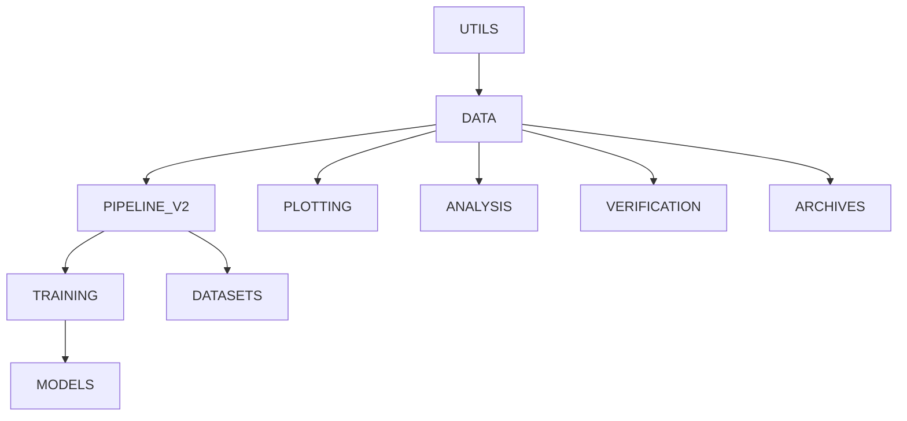

# NCI Developer

This page details how to install the `EDIT` package in a user defined location on GADI for development purposes.

If this doesn't seem like how you want to use EDIT, return [here](./../)


## Order
Installing manually requires a certain order:


## Standalone EDIT

Python virtual environments take up a bunch of inodes are tricky to setup correctly.

It may be best to use the EDIT modules with a standalone EDIT install on top.

### 1. Add to .bashrc
```bash
edit () {
    export PYTHONPATH=~/envs/edit_standalone/:$PYTHONPATH
    module use /scratch/ra02/modules
    module load EDIT
    alias pipinstall="pip install -t ~/envs/edit_standalone/ --no-deps"
}
```

This will use the default EDIT module as its base, this can be fixed if you need to freeze the environment.

Additionally, using `pipinstall` allows us to override where it installs and how it does. To prevent double installing, modules must be installed without their dependencies. But if you need to install something new outside of edit, use `pip install` directly.

### 2. Get EDIT modules and install

```bash

# Clone the Repositories
git clone git@git.nci.org.au:bom/dset/edit-package/data.git 
git clone git@git.nci.org.au:bom/dset/edit-package/training.git 
git clone git@git.nci.org.au:bom/dset/edit-package/utils.git 
git clone git@git.nci.org.au:bom/dset/edit-package/pipeline_v2.git 
git clone git@git.nci.org.au:bom/dset/edit-package/archives/nci.git nci

pipinstall -e utils/
pipinstall -e data/
pipinstall -e pipeline_v2/
pipinstall -e training/
pipinstall -e nci/

```

### 3. Usage.
Run
`edit` in the command line to setup the environment.

Then `python`

### 3.b. ARE

#### Module Directories
`/scratch/ra02/modules`

#### Modules
`EDIT`

#### Environment variables
`PYTHONPATH="~/envs/edit_standalone/"`

## Virtual Environment (NOT RECOMMENDED)
### 1. Creating the Virtual Environment

Setup a `venv` location on `gdata` and make a symlink to it in the `{HOME}` directory

!!! Warning
    By setting your `venv` on `gdata` load times can be an issue, consider setting the `venv` location to `scratch` but keep in mind the NCI File Cleanup process.

```bash
cd {HOME}
mkdir /g/data/{PROJECT}/{USER}/venv
ln –s /g/data/{PROJECT}/{USER}/venv venv

# Load Python 3.11
module load python3

# Make the venv, which will follow the symlink to gdata
python3 -m venv venv/EDIT

# Activate the venv
source ~/venv/EDIT/bin/activate

# Check pip version is correct (i.e., is coming from inside the venv):
~/venv/EDIT/bin/pip

# Install netcdf4 specific to GADI
module load netcdf/4.9.0 hdf5/1.10.7
~/venv/EDIT/bin/pip install --no-binary :all: netCDF4
```

### 2. Get EDIT modules and install

```bash
mkdir /g/data/{PROJECT}/{USER}}/EDIT
cd /g/data/{PROJECT}/{USER}/EDIT

# Clone the Repositories
git clone git@git.nci.org.au:bom/dset/edit-package/data.git 
git clone git@git.nci.org.au:bom/dset/edit-package/training.git 
git clone git@git.nci.org.au:bom/dset/edit-package/utils.git 
git clone git@git.nci.org.au:bom/dset/edit-package/pipeline_v2.git 
git clone git@git.nci.org.au:bom/dset/edit-package/archives/nci.git nci

~/venv/EDIT/bin/pip install -e utils/
~/venv/EDIT/bin/pip install -e data/
~/venv/EDIT/bin/pip install -e pipeline_v2/
~/venv/EDIT/bin/pip install -e training/
~/venv/EDIT/bin/pip install -e nci/

```

### 3. Check it’s all working

```bash
python
```

```python
Python 3.11.0 (main, Nov 18 2022, 08:38:34) [GCC 8.5.0 20210514 (Red Hat 8.5.0-10)] on linux
Type "help", "copyright", "credits" or "license" for more information.

import edit.data
import edit.training

#All Imported

exit()

```

### 4. For use in ARE

The following is the config required to create an ARE instance using the venv just made,

**Open the Advanced Options**

Modules:

```
python3 eccodes esmf netcdf hdf5
```

Python or Conda virtual environment base:
    ```
    /g/data/{PROJECT}/{USER}/venv/EDIT
    ```
